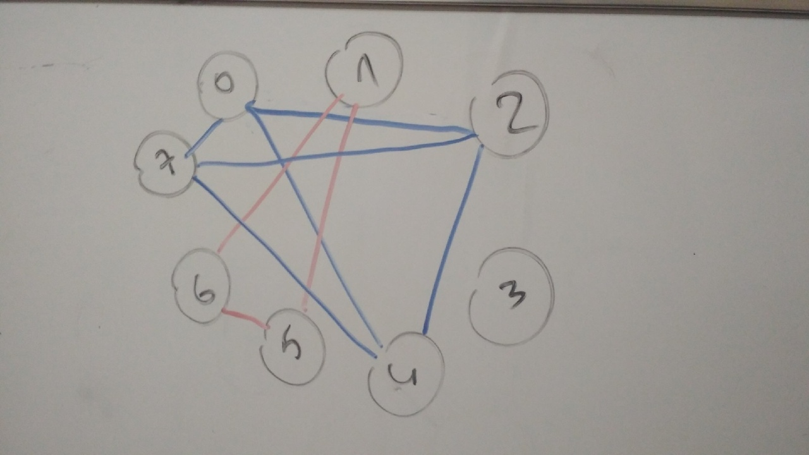

## Условие

Похожие строки. Два столбца матрицы назовем похожими, если они отличаются только порядком элементов. Найти все похожие столбцы.

## Схемы

Задача сводится к графу, который состоит из столбцов (индексов) матрицы и массиву соеденений между вершинами графа. 

Для вывода необходимо разделить граф на подграфы как показано на рисунке.